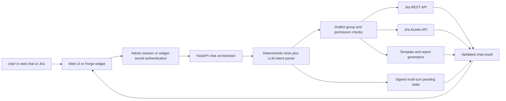

# Jira AI Ticket Bot (FastAPI)

A minimal backend bot that can:
- create Jira tickets
- generate AI summaries for existing tickets
- search Jira from natural-language text by converting it to JQL
- manage admin users, AI model selection, system prompts, and `skills.md`
- work with Jira Assets and generate handover/offboarding documents

## 1) Setup

```powershell
cd D:\download\jira-ai-ticket-bot
python -m venv .venv
.\.venv\Scripts\Activate.ps1
pip install -r requirements.txt
Copy-Item .env.example .env
```

Linux/VPS deployments need LibreOffice Writer for DOCX template previews and DOCX-to-PDF document generation:

```bash
sudo apt-get update
sudo apt-get install -y --no-install-recommends libreoffice-writer fonts-dejavu-core fonts-liberation
```

Fill in `.env`:
- `JIRA_BASE_URL`, for example `https://your-site.atlassian.net`
- `JIRA_EMAIL`, your Atlassian login email
- `JIRA_API_TOKEN`, your Atlassian API token
- `JIRA_PROJECT_KEY`, for example `KAN`
- `OPENAI_API_KEY`, your AI API key
- `OPENAI_BASE_URL`, leave empty for direct OpenAI calls or set to `https://openrouter.ai/api/v1` for OpenRouter models
- `OPENROUTER_SITE_URL` and `OPENROUTER_APP_NAME`, optional but recommended for OpenRouter
- `ASSETS_WORKSPACE_ID`, the Jira Assets workspace ID required for Assets endpoints
- `WIDGET_SHARED_SECRET`, a long random secret that must match `BOT_WIDGET_SECRET` in Forge
- `APP_DATA_DIR`, optional location for the admin database and runtime settings
- `ADMIN_BOOTSTRAP_USERNAME` and `ADMIN_BOOTSTRAP_PASSWORD`, optional bootstrap values for creating the first admin
- `LDAP_BIND_PASSWORD`, optional LDAP service-account password. This remains only in the server environment and is never stored in the Admin UI/database.

## 2) Run Locally

```powershell
uvicorn app.main:app --reload --port 8080
```

Swagger UI:
- [http://127.0.0.1:8080/docs](http://127.0.0.1:8080/docs)

## 3) Architecture And Decision Logic

JiraBot uses a hybrid architecture. The language model interprets natural language and generates text or read-only queries, while deterministic application code validates identities, permissions, state, and every Jira or Assets write.



### What The AI Does

The model is used for tasks where natural-language understanding or generation is useful:

- classify a chat request into an action such as `create`, `search`, `summarize`, `assign`, `onboarding`, or `offboarding`
- extract the fields supported by the current intent schema: summary, description, issue key, assignee, query, issue type, and project key
- convert ticket searches to JQL
- convert generic Assets searches to AQL
- summarize ticket descriptions and comments
- answer normal conversation and RAG-backed questions

The model does not receive Jira credentials and does not call Jira directly. Its output is treated as a proposal that the backend must validate before an operation is performed.

The current intent parser asks the model for JSON shaped approximately like this:

```json
{
  "action": "create|search|summarize|assign|onboarding|offboarding|...",
  "summary": null,
  "description": null,
  "issue_key": null,
  "assignee": null,
  "query": null,
  "issue_type": null,
  "project_key": null
}
```

### What Deterministic Code Does

Python code remains authoritative for operations that must be repeatable and safe:

- authenticate admin and Forge requests
- identify the current Jira user
- enforce JiraBot group permissions for each action
- validate project keys, issue keys, users, Assets objects, and editable attributes
- reject unsafe or invalid generated JQL
- execute Jira and Assets API calls
- preserve multi-turn state between chat messages
- decide which required value is still missing
- assign or unassign devices and synchronize their status
- generate documents and short-lived signed download URLs
- hide internal exceptions and credentials from chat responses

This boundary is intentional. A stronger model improves language understanding, but it does not remove the need for authorization, API validation, or deterministic write logic.

### Hybrid Intent Routing And Regex Fallbacks

The chat router combines two mechanisms:

1. The LLM detects the general intent and returns structured JSON.
2. Deterministic hints and parsers handle common commands, identifiers, counts, issue keys, Assets keys, and values required by multi-step flows.

The hints are not intended to teach the model every possible sentence. They provide predictable behavior for high-impact actions and a fallback when a provider returns incomplete or malformed JSON. They also avoid spending an additional model call on values that can be recognized safely, such as `KAN-12`, `ITAI-6`, or an email address.

There is an important current limitation: the intent schema does not yet contain dedicated fields such as `recipient`, `device_selector`, `missing_fields`, or `confidence`. For onboarding, the model may correctly understand that `onbored imrich koch` means onboarding, but the recipient name is currently extracted by a separate deterministic parser. If that parser does not recognize a spelling variant, the action can be correct while the recipient is missing, causing an unnecessary follow-up question.

The project includes tolerant aliases and normalization for common Slovak and English variants, but enumerating every typo is not the desired long-term architecture. The recommended evolution is structured slot extraction:

```json
{
  "action": "onboarding",
  "recipient": {
    "name": "Imrich Koch",
    "email": null
  },
  "device_selector": null,
  "missing_fields": ["device_selector"],
  "confidence": 0.96
}
```

With this design, the LLM extracts semantic slots, Jira APIs resolve them to real entities, and deterministic code asks only for values that are genuinely missing or ambiguous. Regexes remain useful as fast paths and safety fallbacks rather than the primary entity-extraction mechanism.

### Multi-Turn Conversation State

Onboarding and offboarding are stateful workflows. A typical onboarding sequence is:

1. The user requests onboarding and may already provide the recipient name.
2. JiraBot finds available hardware and asks which device should be handed over.
3. The selected device, recipient, and extra text are carried in a signed pending-action token.
4. The next message is interpreted in the context of that pending action instead of being treated as a new unrelated command.
5. JiraBot resolves the recipient through Jira, generates the document, updates Assets, and returns a signed download link.

Pending state is signed by the backend and has an expiry time. The client cannot safely invent or alter an onboarding/offboarding action. Refreshing or reopening an old popup can discard its current pending state; in that case the original request should be repeated.

The bot should not ask again for information already extracted from an earlier turn. Repeated questions normally indicate one of these conditions:

- the value was not represented by the current AI output schema
- deterministic extraction did not recognize the phrasing
- more than one Jira user or Assets object matched
- the pending token was missing, invalid, expired, or lost after a refresh
- Jira did not return a matching user or object

### Ticket Search And Reporting Logic

Natural-language ticket search follows this path:

1. The model proposes JQL using the configured default project.
2. `jql_guard.py` validates the query and rejects unsafe or out-of-scope expressions.
3. JiraBot executes the read-only Jira search.
4. The API returns both the total and a simplified list of issues.
5. The chat UI renders every issue returned up to the requested API limit.

Reports query Jira with a larger controlled limit, aggregate results in Python, and generate SVG charts plus optional PDF and Excel downloads. Report files use short-lived signed URLs rather than public static paths.

Report titles, column headings, and known Jira statuses, priorities, and issue types are rendered in English by default. JiraBot prefers Atlassian's canonical `untranslatedName` when the API provides it and otherwise translates known localized Slovak labels. Unknown custom workflow labels are preserved instead of being guessed; assignee names are never translated.

### Assets Search And Assignment Logic

Assets support is designed to work with configurable schemas instead of a single hard-coded customer schema:

- natural language can be converted to AQL for general searches
- invalid schema-specific AQL falls back to a broader read and local relevance filtering
- deterministic AQL is used for known high-value queries such as available laptops
- object details are hydrated before matching users or device attributes
- common assignment attribute names such as `Assigned user`, `Assignee`, `Owner`, and localized variants are detected
- an optional text-based `Assigned user` attribute can be created when the object type has no usable assignment attribute
- onboarding writes the resolved Jira user and sets an editable `Status` attribute to `In use` when available
- offboarding clears the assignment and sets an editable `Status` attribute to `Available` when available

The bot verifies Jira users and Assets objects through Atlassian APIs before writes. A model-generated name or object identifier is never assumed to exist.

### Document Generation Logic

Onboarding and offboarding documents use one of these paths:

- an active DOCX template with placeholders, converted to PDF with LibreOffice
- an active PDF template with configured click-to-place coordinates
- a simple fallback PDF when no usable active template exists

Values such as employee name, device name, serial number, and extra text come from the resolved Jira user and selected Assets object. Generated documents are stored outside the public static directory and downloaded through expiring HMAC-signed URLs.

### RAG And Runtime Instructions

Admins can upload knowledge documents and enable RAG for normal chat answers. Retrieved excerpts are explicitly treated as untrusted reference content. Instructions found inside uploaded documents are not executed.

RAG, the editable system prompt, and `skills.md` can influence conversational answers and model interpretation. They do not bypass API authentication, JiraBot permissions, JQL validation, signed pending state, or deterministic Jira/Assets write checks.

### Authentication And Authorization Layers

JiraBot has several separate security identities:

- the Jira API account authenticates backend calls to Atlassian
- the Forge widget authenticates to the backend with `WIDGET_SHARED_SECRET`
- Forge passes the current Jira account ID so JiraBot can apply per-user permissions
- JiraBot admin accounts control runtime settings, models, prompts, templates, RAG, LDAP, groups, and permissions
- local, LDAP, or hybrid authentication applies to the JiraBot admin UI, not to Atlassian login itself

Possessing a valid Jira API token is not sufficient for Assets operations. The API account must also have the required Jira Service Management product access and relevant Assets schema roles.

### Deployment Boundaries And Site Migration

The solution consists of three separately configured parts:

1. The FastAPI backend runs on the VPS and stores runtime configuration, admins, templates, RAG documents, generated files, and integration credentials.
2. The Forge app is deployed by Atlassian and installed into a specific Jira site. It provides the issue-panel/modal UI and forwards authenticated chat requests to the backend.
3. Jira and Jira Assets remain the systems of record for users, tickets, projects, schemas, and devices.

The Forge panel and standalone web chat call the same backend chat orchestration, but they have different authentication context. Forge supplies the current Atlassian account ID; the standalone chat uses a JiraBot admin session.

Moving JiraBot to another Atlassian site requires updating and verifying at least:

- `JIRA_BASE_URL`, `JIRA_EMAIL`, `JIRA_API_TOKEN`, and `JIRA_PROJECT_KEY`
- `ASSETS_WORKSPACE_ID`, because workspace IDs belong to a specific Atlassian site
- Jira Service Management and Assets product access for the API account
- Assets schema roles and expected editable attributes
- project issue types, workflows, priorities, and localized status names
- Forge installation on the new site and matching backend/widget secrets
- JiraBot groups, because Atlassian account IDs and site users may differ

Backend-local data such as admin accounts, prompts, `skills.md`, templates, RAG documents, and LDAP settings stays on the VPS and can remain unchanged when only the Jira site changes. Jira tickets, Assets schemas, Assets objects, user IDs, and Forge installation state do not automatically migrate with it.

### Adding A New Chat Capability

A production chat action normally requires changes across several layers. Adding only a prompt rule is not sufficient:

1. Add the action and its semantic fields to the AI intent schema.
2. Add deterministic routing only where a high-confidence fast path is useful.
3. Define the required JiraBot permissions in the action-permission map.
4. Resolve and validate all Jira/Assets entities through Atlassian APIs.
5. Implement the operation with read/write boundaries and useful error handling.
6. Add signed pending state if the operation needs multiple turns.
7. Format the response and download links in both the Forge and standalone UIs.
8. Add unit tests plus a live smoke test using realistic Slovak, English, vague, misspelled, and ambiguous requests.
9. Document the capability and its limitations in this README and `skills.md`.

For write actions, tests should verify both the chat response and the resulting Jira/Assets state. A successful natural-language response alone does not prove that a ticket was closed, a device was assigned, or a document contains the correct data.

### Language And Model Behavior

The LLM can understand Slovak and English, including many informal phrases. Deterministic normalization removes case and diacritics for matching where appropriate. However, model output is probabilistic and different models can classify vague input differently. The backend therefore prefers explicit validation over trusting model confidence alone.

Changing to a larger model can improve ambiguous-language handling, summaries, and query generation. It cannot fix a missing field in the application JSON schema, expired state, insufficient Jira permissions, or an invalid Assets configuration.

## 4) Endpoints

All endpoints that read or modify Jira/Assets data require authentication:
- admin bearer token from `/admin/api/login`: `Authorization: Bearer <token>`
- or Forge/widget secret: `X-Widget-Secret: <WIDGET_SHARED_SECRET>`

`/chat/widget` always requires `WIDGET_SHARED_SECRET`. The public web chat `/` works after admin login on the same domain.

### Chat Endpoint (All-In-One)

`POST /chat`

Example bodies:
```json
{
  "message": "Create ticket: Login fails after deploy, users get 500",
  "max_results": 20,
  "max_comments": 20
}
```

```json
{
  "message": "Summarize KAN-1"
}
```

```json
{
  "message": "Find open tickets about login problems from the last 2 weeks"
}
```

### Create Ticket

`POST /tickets/create`

Example body:
```json
{
  "summary": "Login failure after deploy",
  "description": "After release 1.2.4, login fails for some users.",
  "issue_type": "Task"
}
```

### Assign Ticket

`POST /tickets/assign`

Example body:
```json
{
  "issue_key": "KAN-12",
  "assignee_query": "imrich"
}
```

### Summarize Ticket

`POST /tickets/summarize`

Example body:
```json
{
  "issue_key": "KAN-1",
  "max_comments": 20
}
```

### Search By Text

`POST /tickets/search`

Example body:
```json
{
  "query": "Find open tickets about login problems from the last 2 weeks",
  "max_results": 20
}
```

The response returns:
- AI-generated JQL (`jql`)
- `total`
- simplified issue list

### Similar/Identical Tickets

`POST /tickets/similar`

Example:
```json
{
  "issue_key": "KAN-1",
  "top_k": 5
}
```

or:
```json
{
  "text": "login fails after deploy with 500",
  "top_k": 5
}
```

### Assigning Services To Incidents

`POST /inc/classify-service`

Example:
```json
{
  "issue_key": "KAN-4",
  "top_k": 3
}
```

Service mapping is read from `service_catalog.json` (`name` + `keywords`).

### Correlations Between Incidents / Patches / Deploys

`POST /inc/correlate-changes`

Example:
```json
{
  "incident_issue_key": "KAN-4",
  "lookback_days": 14,
  "top_k": 10
}
```

### Assets Natural-Language Search (Owner/HW/Job-File/DORA/SLA)

`POST /assets/search`

Example:
```json
{
  "query": "who owns the payroll-api service",
  "max_results": 20
}
```

Note: the endpoint converts natural language to AQL and queries Jira Assets.

### End Of Contract - Access Checklist From Jira Tickets

`POST /offboarding/checklist`

Example:
```json
{
  "user_identifier": "john.doe@company.com",
  "lookback_days": 365,
  "max_results": 100
}
```

### Offboarding Document From Template

`POST /offboarding/document`

Example:
```json
{
  "user_identifier": "imrich koch",
  "extra_text": "Return the laptop, charger, and docking station."
}
```

Returns a short-lived signed download URL under `/download/offboarding/...`. If an active DOCX/PDF template is configured in the admin UI, it is used. If no template is configured, the bot creates a simple fallback PDF document.

In the chat UI, offboarding/return protocol is a two-step flow:
- the bot first finds the Jira user and their assigned hardware Assets objects
- it asks which device is being returned
- after selection by number, Assets key, or text, it generates a document from the active template
- after document generation, it tries to clear the optional editable assignment attribute in Assets, for example `Assigned user`

Onboarding / handover protocol works similarly:
- the bot first offers available hardware devices from Assets
- if no free device is found, it also shows currently assigned devices with a warning that selecting one will overwrite the assignment
- the user selects a device and provides the name/email of the recipient
- the bot generates a document from the active onboarding template
- after document generation, it tries to write the user into an editable assignment attribute in Assets, for example `Assigned user`

### Print Protocol In Jira Assets

`POST /assets/print-protocol`

Example:
```json
{
  "object_query": "notebook imrich koch"
}
```

Returns a markdown protocol with object attributes.

## 5) Admin UI

Admin UI is available at:
- `/admin`

Admins can:
- create additional admins
- choose the AI model for future bot responses from a larger provider catalog
- use OpenAI models directly or OpenRouter model IDs for Anthropic, Google, DeepSeek, Meta/Llama, Mistral, Qwen, xAI, and others
- use OpenAI-compatible Chat Completions via OpenRouter/custom `OPENAI_BASE_URL`
- edit the system prompt
- edit `skills.md`, which is included in AI instructions
- upload onboarding/offboarding templates in DOCX/PDF format
- configure click-to-place positions for employee name, PC/device, serial number, and extra text
- use DOCX files as source templates: JiraBot converts them with LibreOffice for an accurate PDF preview and generates the final document as PDF
- configure optional LDAP/Active Directory administration login. Start in `Local` mode; `Hybrid` allows LDAP admins and local break-glass admins, while `LDAP` permits only members of the configured LDAP admin group. LDAP settings contain no password; the bind password is read from `LDAP_BIND_PASSWORD`.

The first admin can be bootstrapped through environment variables:
- `ADMIN_BOOTSTRAP_USERNAME`
- `ADMIN_BOOTSTRAP_PASSWORD`

After creating the first admin, remove the bootstrap values from the env file and restart the service. The existing admin remains stored in the SQLite database.

Runtime data is stored in `data/` or in the path configured via `APP_DATA_DIR`:
- `admin.sqlite3` contains admin accounts, hashed passwords, and session tokens
- `bot_settings.json` contains the current model and system prompt
- `skills.md` contains editable bot instructions/capabilities
- `offboarding_templates/` contains metadata and uploaded offboarding templates

`data/` is in `.gitignore` to keep passwords, tokens, sessions, and production settings out of GitHub.

Note about `skills.md`: it acts as a practical instruction layer for the Jira bot. Admins can change bot behavior without redeploying, for example response style, Jira ticket rules, or how chat requests should be interpreted.

## 6) Security Notes

- Keep API tokens only in `.env`; never commit them.
- Admin passwords are stored as hashes, not plaintext.
- The admin session token is stored in browser `localStorage`, so use the admin UI only over HTTPS.
- Public API endpoints require either an admin session/bearer token or the Forge widget secret.
- If AI returns invalid JQL, `jql_guard.py` can reject it.
- Multi-turn pending actions are signed and expire; the backend rejects missing, modified, or expired state.
- Model output is never treated as proof that a Jira user, ticket, project, or Assets object exists.
- Generated documents and reports are served through expiring signed downloads rather than public static URLs.

## 7) Future Extensions

- `/tickets/update` endpoint
- create deduplication by fingerprint
- Slack/Teams chat layer on top of this API
- replace action-specific recipient regexes with structured semantic slot extraction
- add explicit `recipient`, `device_selector`, `missing_fields`, and `confidence` fields to the intent schema
- store conversational workflow state server-side for longer-lived sessions while retaining signed client references
- add multilingual intent regression suites with typos, vague requests, and ambiguous entity names

## 8) Jira Chat Widget (Forge)

Endpoint for the Forge widget:
- `POST /chat/widget`
- uses the same logic as `/chat`
- requires the `x-widget-secret` header when `WIDGET_SHARED_SECRET` is configured

Forge app skeleton is in:
- `forge-jira-chat`

Deployment is described in:
- `forge-jira-chat/README.md`
